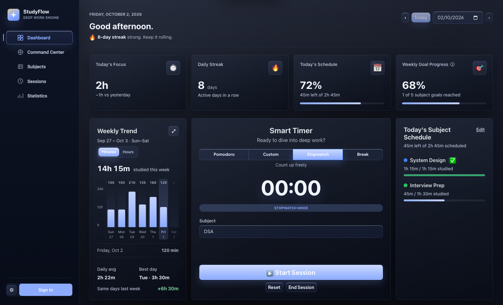
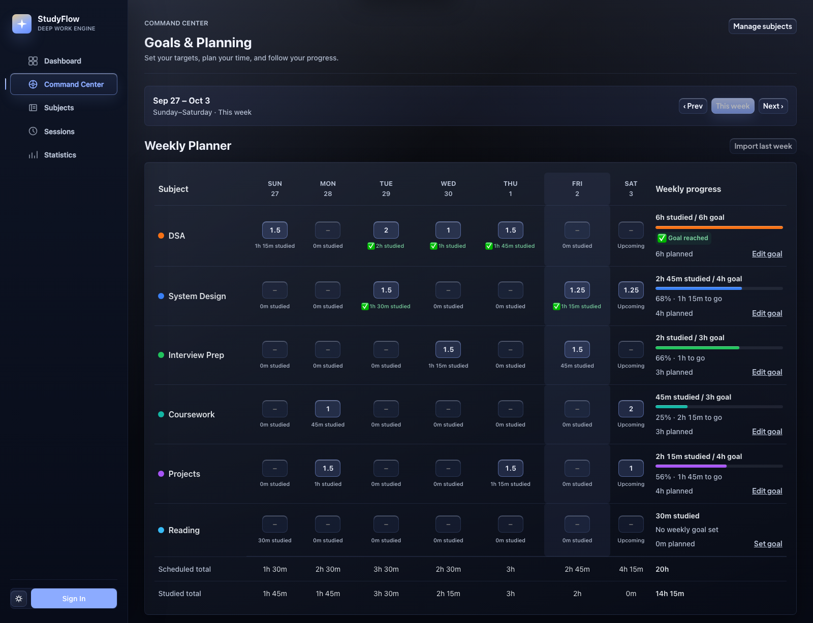
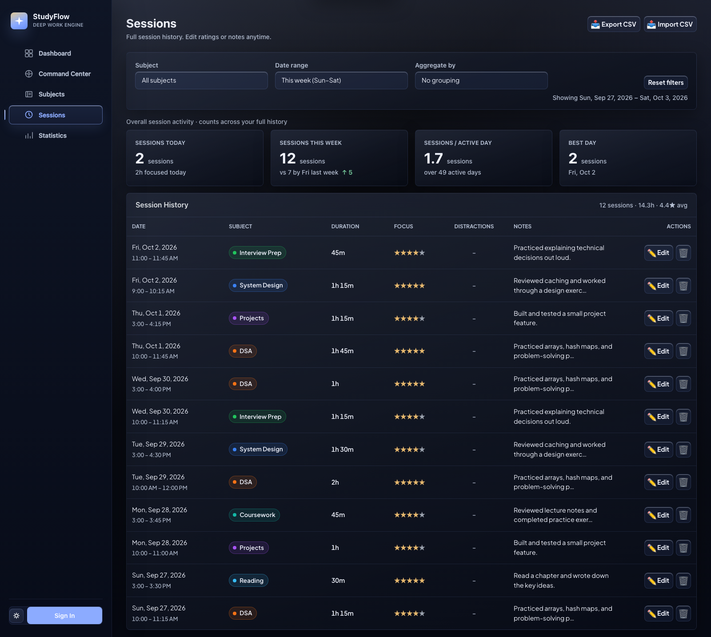
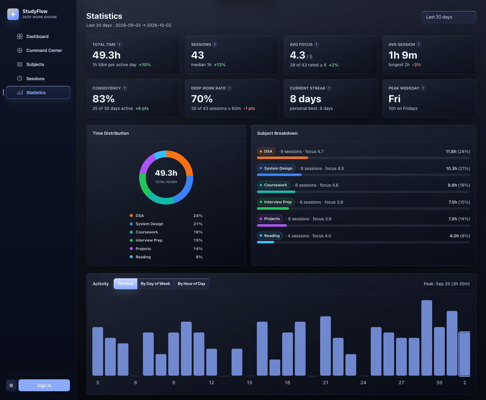

# StudyFlow

**A one-stop workspace to plan your week, focus on your work, and see your progress.**

StudyFlow brings subjects, weekly goals, scheduling, a study timer, session history, and analytics into one connected app. Use it for coursework, DSA, interview preparation, personal projects, or any work you want to make time for.

[Open StudyFlow](https://studyflow-v1r4v.vercel.app/)



*All screenshots use my study data captured from the app. Users have to populate and build data with time and tracking*

## The idea behind StudyFlow

When you are balancing classes, interview preparation, and projects, it helps to see both your intentions and your actual effort. StudyFlow started with a simple idea: a screen-time-style dashboard for studying, where you can see where your focused time goes and how it adds up.

The app connects a practical loop: **plan → focus → save → review → adjust**. Set a goal, make room for it during the week, and study. Each saved session feeds your history, weekly progress, and statistics, so you can decide what deserves your attention next.

The aim is to make everyday tracking easy enough to keep using, with the detail needed to answer useful questions: How much did I study? Which subject needs more time? Am I meeting my goals? When do I tend to focus best?

## One connected workflow

| Page | What it helps you do |
| --- | --- |
| **Dashboard** | Start a timer, review daily focus and streaks, switch the weekly trend between minutes and hours, and see your schedule and subject progress. |
| **Command Center** | Set weekly goals and plan time from Sunday through Saturday. See logged study beneath each day and colored goal progress beside each subject. |
| **Subjects** | Create and manage subject names and colors, with links to their sessions and planning. |
| **Sessions** | Review recorded work, filter by subject or date, group sessions by day, week, or month, edit entries, and import or export CSV. |
| **Statistics** | Explore time distribution, subject breakdowns, focus ratings, consistency, streaks, activity patterns, and the study calendar heatmap. |

The timer supports **Pomodoro, custom countdown, stopwatch, and break modes**. When you finish a study session, review its duration and save it with a focus rating, notes, and distraction count. Breaks are recorded separately from study time.

## The thinking behind the design

- **Progress follows saved study.** A one-hour DSA session moves a two-hour DSA goal to 50%, even if you never scheduled it. Entering planned hours sets your intention; studying earns the progress.
- **Each subject has its own target.** Extra time on one subject stays in your total study time. It does not finish an untouched goal for another subject. Reached goals get an automatic checkmark.
- **Each page has a clear job.** Subject details live in Subjects, goals and scheduling live in Command Center, and the dashboard brings your activity together. The planner keeps progress beside the plan so you can adjust it in context.
- **Weeks and time should be understandable.** Weekly dashboard progress, planning, and session comparisons use Sunday–Saturday. Recorded seconds are preserved, and the dashboard lets you explore earlier days and weeks.
- **Color and reflection connect the experience.** Subject colors carry through the planner, history, and charts. Notes and focus ratings add context to the hours, helping you recognize patterns and make a better plan for the next week.

## Take a look

<details>
<summary>📅 Command Center — weekly planning and subject goals</summary>



Plan daily hours, edit weekly targets, and follow actual study progress in the same table. You can also import last week's plan into empty slots.

</details>

<details>
<summary>📝 Sessions — a record of the work you did</summary>



Filter and group your sessions, correct an entry, and keep your work portable with CSV import and export.

</details>

<details>
<summary>📊 Statistics — understand your patterns over time</summary>



Explore a day, a preset time range, or a custom window. See how your time is distributed and use activity views and the heatmap to explore when you study.

</details>

## Start your own flow

1. Add the subjects or activities you want to track.
2. Set weekly goals and schedule time in Command Center.
3. Choose a subject on the dashboard and start a timer.
4. Save your session, then review your progress and adjust the next day's plan.

Guest mode stores data in your browser. Sign in with Google or email and password to save your subjects, sessions, and plans in Firebase and access them across devices. The app supports light and dark themes and responsive layouts.

## Technology

- **Interface:** React, React Router, React Bootstrap, and Bootstrap.
- **Build tooling:** Vite.
- **Charts:** Custom SVG and CSS visualizations.
- **Accounts and storage:** Firebase Authentication and Cloud Firestore, with localStorage for guest data and signed-in caching.
- **Hosting:** Vercel.
- **Regression tests:** Node's built-in test runner.

## Run locally

Use **Node.js 20.19+ (20.x) or 22.12+**, and npm.

```bash
git clone https://github.com/V1R4V/StudyFlow.git
cd StudyFlow
npm ci
```

Create a `.env` file in the project root with your Firebase web app configuration:

```dotenv
VITE_FIREBASE_API_KEY=your-api-key
VITE_FIREBASE_AUTH_DOMAIN=your-project.firebaseapp.com
VITE_FIREBASE_PROJECT_ID=your-project-id
VITE_FIREBASE_STORAGE_BUCKET=your-storage-bucket
VITE_FIREBASE_MESSAGING_SENDER_ID=your-messaging-sender-id
VITE_FIREBASE_APP_ID=your-app-id
```

Enable Google and/or email/password sign-in in Firebase Authentication and create a Firestore database. The repository's access rules are in [firestore.rules](firestore.rules). Analytics and App Check can be configured through the optional `VITE_FIREBASE_MEASUREMENT_ID` and `VITE_FIREBASE_APPCHECK_SITE_KEY` variables.

```bash
npm run dev
```

Open the localhost URL printed by Vite, usually `http://localhost:5173`.

To check the calculation regressions and create a production build:

```bash
npm test
npm run build
```
